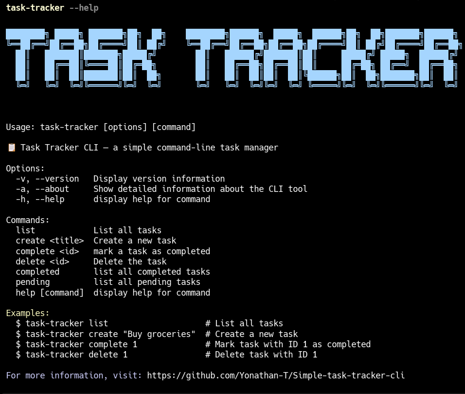
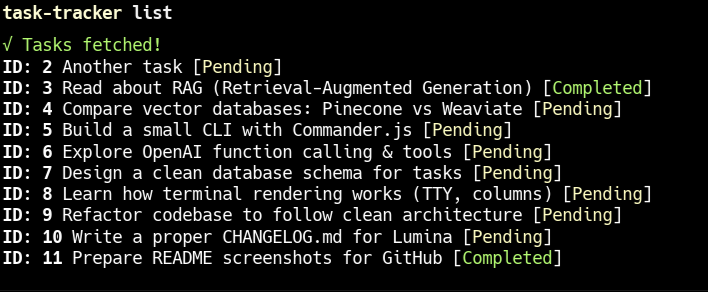
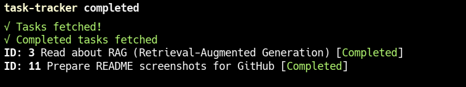
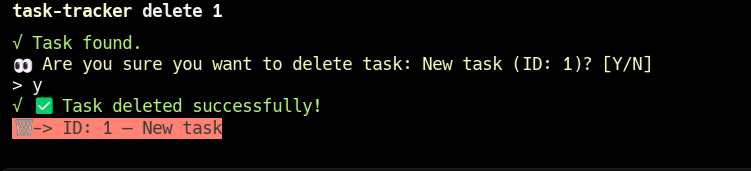

# 📋 Task Tracker CLI

A Simple command-line interface (CLI) for managing tasks, built with JavaScript and Node.js. It connects to a Laravel API hosted on Render, using a PostgreSQL database to store tasks. Features include adding, listing, completing, and deleting tasks with colorful output and loading animations.

## ✨ Features

- Create and manage tasks with simple commands
- Mark tasks as completed with visual feedback
- Delete tasks with confirmation prompts
- View only completed or only pending tasks
- Persistent user sessions across sessions
- Beautiful colored output and progress indicators
- Automatic user registration and session management

## � Screenshots

<div align="center">

|                           Main Interface                           |                           Task List                           |
| :----------------------------------------------------------------: | :-----------------------------------------------------------: |
|  |  |

|                             Completed Tasks                              |                            Delete Task                            |
| :----------------------------------------------------------------------: | :---------------------------------------------------------------: |
|  |  |

</div>

## �🛠 Built with

- Node.js and Commander.js for CLI framework
- Axios for HTTP requests
- Chalk for beautiful terminal output
- Ora for loading spinners
- UUID for unique user identification

## 📋 Requirements

- Node.js: Version 16 or higher (tested with v23.10.0)
- npm: For installing dependencies
- API Access: A running Laravel API at https://simple-task-api-88g5.onrender.com/ (see the [backend repo](https://github.com/Yonathan-T/Backend) for setup)

## 🚀 Installation

### Option 1: Install globally (Recommended)

```bash
# Clone the repository
git clone https://github.com/Yonathan-T/Simple-task-tracker-cli
cd Simple-task-tracker-cli

# Install dependencies
npm install

# Install globally to use as a command
npm install -g .
```

Now you can use the CLI from anywhere with the `task-tracker` command!

### Option 2: Run directly

```bash
# Clone the repository
git clone https://github.com/Yonathan-T/Simple-task-tracker-cli
cd Simple-task-tracker-cli

# Install dependencies
npm install

# Run with node
node tracker.js <command>
```

## 📖 Usage

### Getting Help

```bash
# Show all available commands
task-tracker --help

# Show version
task-tracker --version

# Show detailed information about the CLI
task-tracker --about
# or
task-tracker -a
```

### List all tasks

```bash
task-tracker list
```

**Output:**

```
✔ Tasks fetched!
ID: 1 Buy groceries [Pending]
ID: 2 Complete project [Completed]
```

### List only completed tasks

```bash
task-tracker completed
```

**Output:**

```
✔ Completed tasks fetched
ID: 2 Complete project [Completed]
```

### List only pending tasks

```bash
task-tracker pending
```

**Output:**

```
✔ Pending tasks fetched
ID: 1 Buy groceries [Pending]
```

### Create a task

```bash
task-tracker create "Buy groceries"
```

**Output:**

```
✔ Task created!
Buy groceries Added Successfully ✅
```

### Mark a task as completed

```bash
task-tracker complete 1
```

**Output:**

```
✔ Task marked as completed!
Task ID 1 Buy groceries (with strikethrough)
```

### Delete a task (requires confirmation)

```bash
task-tracker delete 1
```

**Output:**

```
✔ Task found.
👀 Are you sure you want to delete task: Buy groceries (ID: 1)? [Y/N]
> Y
✔ Task deleted successfully!
🗑 -> ID: 1 — Buy groceries
```

## 🔧 First Time Setup

When you run any command for the first time, the CLI will:

1. Automatically create a unique user ID for you
2. Register you with the backend API
3. Store your user ID locally for future sessions
4. Proceed with your requested command

**Note:** You'll only see registration messages on your first use. Subsequent commands will run silently.

## 🐛 Troubleshooting

### No tasks found or API Errors

- Ensure the Laravel API is running at https://simple-task-api-88g5.onrender.com/
- Check your internet connection
- Verify the API endpoint is accessible

### CLI errors

- Ensure all dependencies are installed: `npm install`
- Make sure you're using Node.js version 16 or higher
- If installed globally, try reinstalling: `npm uninstall -g task-tracker-cli && npm install -g .`

### Command not found

- If using global installation, ensure the package is installed globally: `npm install -g .`
- Try running with node directly: `node tracker.js <command>`

## 📝 Examples

```bash
# Get help
task-tracker --help

# Learn about the CLI
task-tracker --about

# List all tasks
task-tracker list

# List only completed tasks
task-tracker completed

# List only pending tasks
task-tracker pending

# Create multiple tasks
task-tracker create "Buy groceries"
task-tracker create "Complete project documentation"
task-tracker create "Call client"

# Complete tasks
task-tracker complete 1
task-tracker complete 2

# Delete a task
task-tracker delete 3
```

## 🌐 Repository

- **Frontend CLI**: https://github.com/Yonathan-T/Simple-task-tracker-cli
- **Backend API**: https://github.com/Yonathan-T/Backend

## 📧 Support

Star the Repo ⭐ or open an issue on GitHub for questions or feedback!
